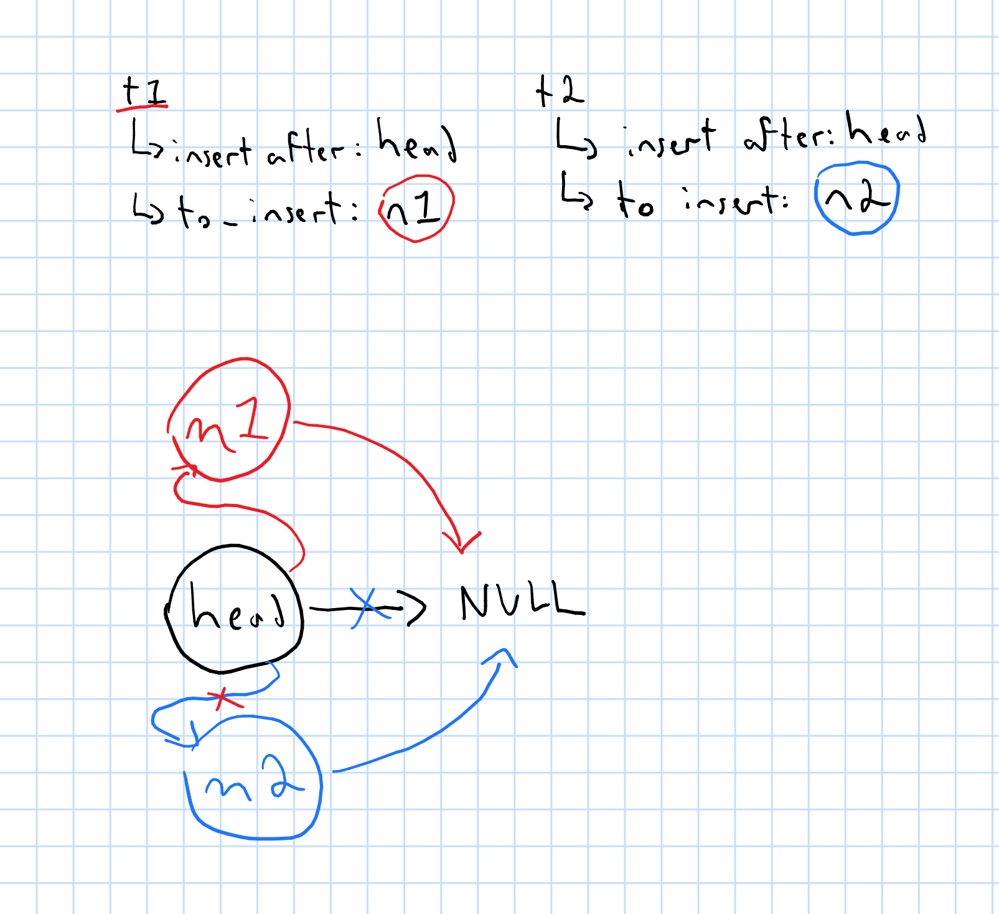

Overview
========

This contains some code we will be using to think about threads.

Building and running
====================

This repository has many files that are all independent programs.

You can build all programs with `make`:

```bash
make
```

`threads.c`
----------

This is a program that was originally written with processes (i.e., using
`fork`) but has been rewritten to use threads (specifically POSIX
threads/pthreads).

You can run this program on the command line:

```bash
./threads
```

When entering input we're using `getchar()`, so if you are entering a value you
should use <kbd>Ctrl+D</kbd> to indicate you are done entering input instead of
pressing <kbd>Enter</kbd>.

The two threads of execution are running in the same address space, so when the
new thread changes the value of `c`, the change is reflected in the main thread
of execution. The value of `c` is also only printed out *once* --- when the new
thread we asked to be created `return`s from the function, it ends and does not
go back to where `pthread_create` was initially called.

`critical-sections/*.c`
-----------------------

All examples of code in this directory may or may not contain a critical
section. Most of the programs in this directory run to completion reliably, but
some will fail with errors like Segmentation fault, and this is expected.

For programs that do run to completion, some will produce unexpected results;
that the programs don't produce the expected result *is expected*.

All of these examples can be run on the command line from the
`critical-sections` directory:

```bash
cd critical-sections
./textbook-sample
./textbook-sample-modified-a
./textbook-sample-modified-b
./list-traversal-a
./list-traversal-b
./list-insertion
```

We focused mostly on the `textbook-example*.c` and `list-insertion.c` files.

### `textbook-sample.c`

As originally written, this program contained a critical section: both threads
of execution that we created in the main thread tried to read and then update
the shared `counter` resource. This meant that any time we run this code we will
"lose" add operations --- when thread 1 loads and is then interrupted, it will
overwrite the add that thread 2 makes.

The question I left you with was this: Every time we ran this program the value
was much less than 2000000 (the expected output), could the output ever be
*more* than 2000000?

This program has been modified to protect its critical section with
`pthread_mutex_lock`, so it now works as expected.

We tried protecting the critical section of this in multiple places:

1. Inside the loop, then
2. Outside the loop.

We used [`hyperfine`](https://github.com/sharkdp/hyperfine/) to compare the
performance of the two implementations. What we discovered was:

1. Acquiring and releasing a lock 2000000 times between the two threads has a
   significant performance impact (when we put the lock and release inside the
   loop structure).
2. Acquiring and releasing the lock exactly once per thread had almost exactly
   the same performance characteristics as not using locks at all (when we put
   the lock and release outside the loop). The main problem with this is that
   we're effectively making one thread wait until the other thread is completely
   done; we have effectively no concurrency.

### `list-insertion.c`

This is an example of concurrently modifying a list. This code does have a
critical section: updating the list is not atomic when multiple threads of
execution are trying to update the same resource. In this case: when attempting
to insert after the same node.

The code appears to work correctly for very few numbers of insertions (<1000).
When we increase the number of insertions to 1000+ (we stopped at 1000000), we
begin to "lose" nodes: nodes are partially inserted to the list by a thread
before the thread is interrupted and another thread takes over.

The result that we're seeing is effectively this:



We will continue to update this code to add locks to prevent this from
happening.

`deadlock.c`
-----------

This is a code sample we will look at to decide if it is possible for deadlock
to occur by thinking about the four conditions for deadlock.

You can run this code on the command line:

```bash
./deadlock
```

The output *should* always be the same (both accounts have $1000), except in
exceptional circumstances (e.g., maybe this code deadlocks).

`thr_pool` and `3430-pool`
--------------------------

These are examples of thread pools. `thr_pool` is an example of some real-world
code by Oracle. `3430-pool` is a significantly reduced example that we will work
through in class.

Both of these examples use locks and condition variables to synchronize access
to critical sections and notify workers when there is new work in the queue for
them to work on. We stepped through *an* example of concurrent execution of
`3430-pool` in class and drew this picture:


When working through this in class we made arbitrary decisions about when the
threads of execution were getting interrupted, including making the arbitrary
decision that the main thread just goes away and does nothing while the worker
threads begin to spin up. In reality, our main thread of execution may begin
submitting tasks to the pool and asking the pool to shut down before any threads
were able to start.

